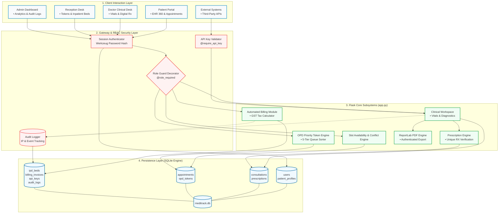

# 🏥 MediTrack — Integrated Patient Care & Clinical Management System

[](https://www.python.org/)
[](https://flask.palletsprojects.com/)
[](https://www.sqlite.org/)

MediTrack is an enterprise-grade hospital information and electronic health record (EHR) web application. Designed for multi-department clinical environments, it provides conflict-free appointment booking, priority-tier triage queuing, digital prescription issuing with tamper-evident verification, and developer REST APIs.

---

## 📸 System Previews

> *Tip: To display your actual UI screenshots, place image files in a `docs/screenshots/` folder in your repo and update the paths below.*

| Doctor Clinical Workspace | Live OPD Queue TV Board |
| :---: | :---: |
|  |  |

| Patient EHR & Digital Rx | Reception & Triage Operations |
| :---: | :---: |
|  |  |

---

## 🏛️ System Architecture

MediTrack follows a modular Model-View-Controller (MVC) pattern powered by Flask and SQLite, enforcing strict relational constraints at the database engine level.


## ✨ Core Capabilities & Highlights

- **Role-Based Access Control (RBAC):** Dedicated, secure access portals for 4 distinct user tiers: `patient`, `doctor`, `receptionist`, and `admin`.
- **Conflict-Lock Appointment Scheduling:** Database-level uniqueness constraints `UNIQUE(doctor_name, appointment_date, appointment_time)` eliminate double-booking even under concurrent submissions.
- **Priority Outpatient (OPD) Triage:** Dynamic waitlist token engine with 5-tier priority weighting:
  1. `Emergency` (Priority 1 — Triggers visual pulse alert)
  2. `Senior Citizen` (Priority 2)
  3. `Pregnant Woman` (Priority 3)
  4. `Child` (Priority 4)
  5. `Regular` (Priority 5)
- **Live Waiting Room TV Display:** Fullscreen display board (`/queue/live`) with real-time JSON polling every 4 seconds.
- **Doctor Clinical Workspace:** Direct capture of vital signs (Blood Pressure, Heart Rate, Temperature, $\text{SpO}_2$) alongside symptoms, diagnoses, and treatments.
- **Tamper-Evident Prescriptions:** Generates cryptographic prescription identifiers (`RX-XXXXXX`) with a public ledger verification portal (`/prescriptions/verify/<rx_code>`).
- **Automated Billing & Inpatient (IPD) Management:** Bed occupancy tracking for General, ICU, Pediatric, and Maternity wards with automated GST invoice generation.
- **Enterprise PDF Generation:** Instant generation of authenticated diagnostic reports and prescription sheets using `ReportLab`.
- **Developer REST APIs:** Programmatic access guarded by `X-API-Key` headers (`mtk_live_...`).

---

## 🔑 Default Demonstration Accounts

The database automatically initializes default credentials on startup:

| Portal | Username / Email | Password | Primary Functions |
| :--- | :--- | :--- | :--- |
| **System Admin** | `admin@meditrack.com` | `Admin@123` | Executive KPI analytics, audit trail review, CSV data exports |
| **Receptionist** | `reception@meditrack.com` | `Reception@123` | OPD token issuance, ward bed check-in/out, triage coordination |
| **Lead Doctor** | `smith@meditrack.com` | `Doctor@123` | Patient queue, vitals logging, digital Rx issuance |
| **Staff Doctor** | `sharma@meditrack.com` | `Doctor@123` | General medicine consultations and diagnostics |
| **Patient** | *Self-register at `/register`* | *Custom* | Slot reservations, EHR 360 view, PDF report downloads |

---

## 🚀 Installation & Local Deployment

### Prerequisites
- Python 3.10 or higher
- Git installed on your machine
-  1. Clone the Repository
bash
git clone [https://github.com/VarunGunnala/MediTrack-Healthcare-System.git](https://github.com/VarunGunnala/MediTrack-Healthcare-System.git)
cd MediTrack-Healthcare-System

2. Configure Virtual Environment
Windows (PowerShell):

PowerShell
python -m venv .venv
.venv\Scripts\activate

3. Install Dependencies
Bash
pip install -r requirements.txt
4. Initialize Database & Run Server
Bash
python app.py
The application will start on http://127.0.0.1:8080.

## 📂 Project Directory Structure

```text
MediTrack-Healthcare-System/
├── static/
│   ├── css/
│   │   └── style.css            # Responsive layout & modern design system
│   └── uploads/
│       └── avatars/             # User and staff avatars
├── templates/
│   ├── base.html                # Navigation bar, role logic, and alert modals
│   ├── index.html               # Hospital landing page & doctor showcase
│   ├── login.html               # Multi-role authentication interface
│   ├── register.html            # Intake form & automated patient ID generator
│   ├── appointments.html        # Interactive slot booking matrix
│   ├── profile.html             # Longitudinal EHR 360 timeline & reports
│   ├── doctor_portal.html       # Clinical workspace, vitals & prescription writer
│   ├── receptionist_portal.html # Triage desk, priority OPD tokens & ward beds
│   ├── admin_dashboard.html     # Real-time analytics, revenue, & audit logs
│   ├── display_board.html       # Live OPD queue waiting room TV board
│   └── api_keys.html            # Developer API key generator & token list
├── docs/
│   └── screenshots/             # Documentation visuals & UI captures
├── app.py                       # Core Flask backend, database schemas, and routes
├── requirements.txt             # Project library dependencies
├── .gitignore                   # Git exclusion rules (.venv, cache, local DBs)
└── README.md                    # System documentation and setup guide
```
